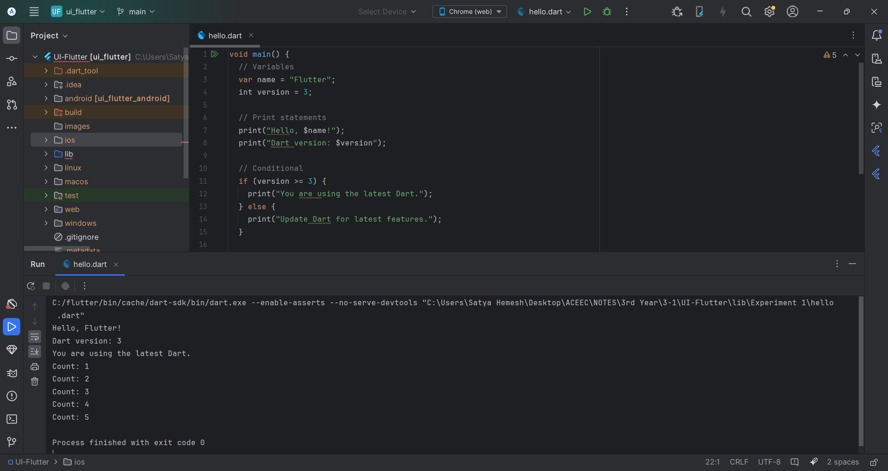
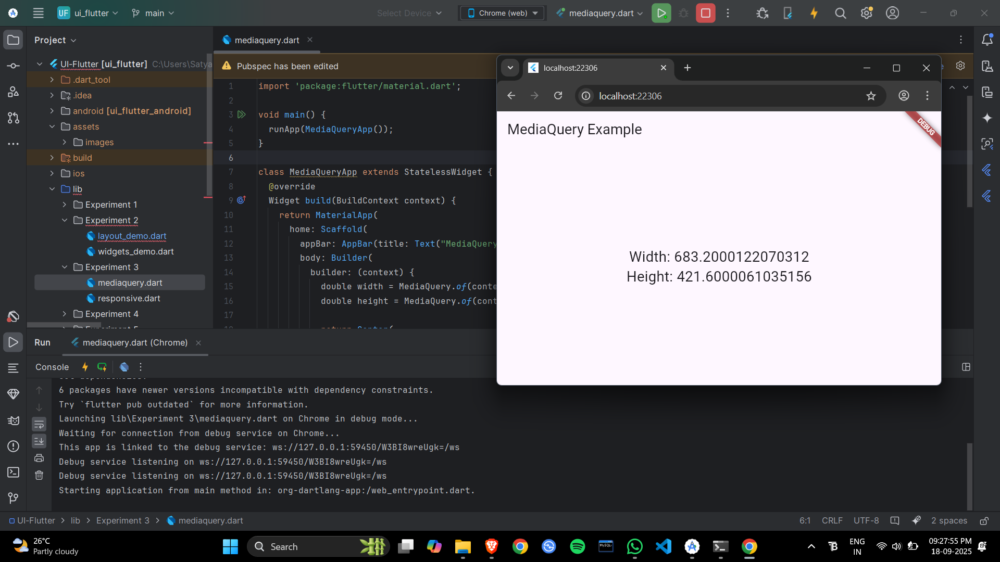
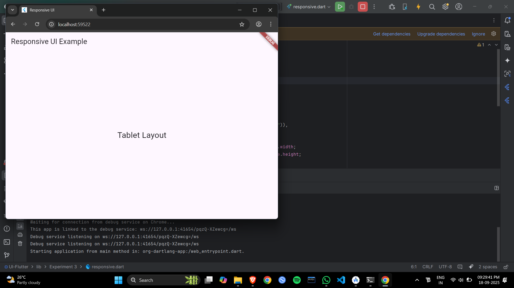
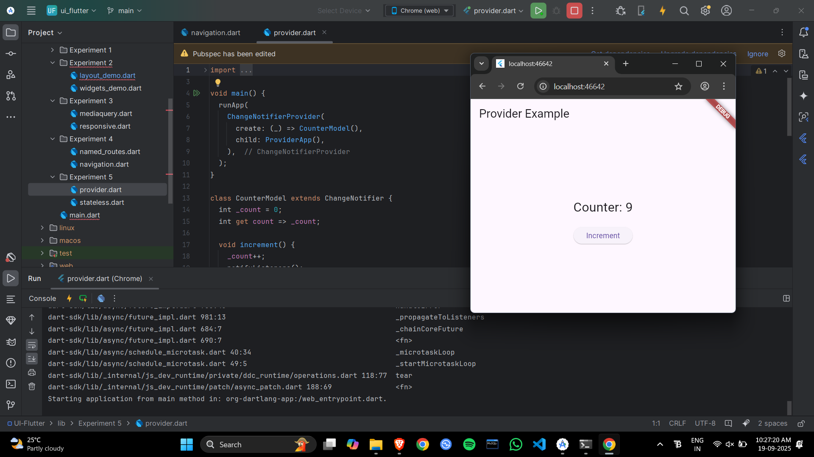
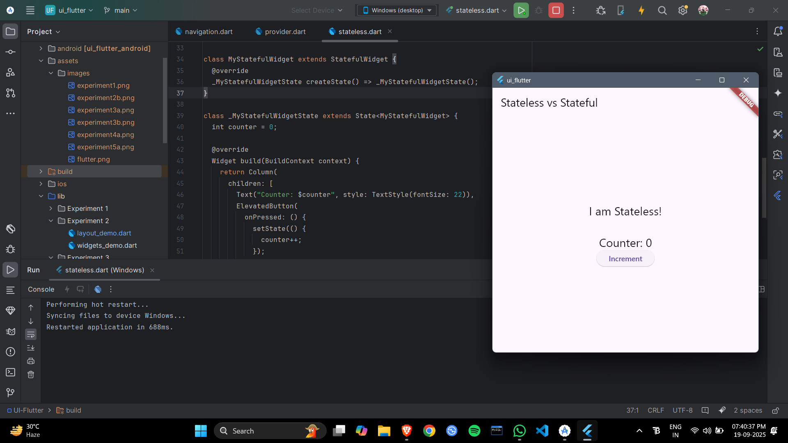

# UI-Flutter Experiments 1–5

## Overview

This repository contains five Flutter UI experiments (Experiment 1 through Experiment 5).  
Each experiment demonstrates different UI design and functionality in Flutter.

If your folder structure differs, this README was created using a best-effort analysis of the archive and includes links to images and detected files.

### Requirements

- Flutter SDK (>= 2.x)
- Android Studio or VS Code
- An Android/iOS simulator or device

---

## Table of contents

- [Experiment 1](#experiment-1)
- [Experiment 2](#experiment-2)
- [Experiment 3](#experiment-3)
- [Experiment 4](#experiment-4)
- [Experiment 5](#experiment-5)

---

### Experiment 1

**Location / sample files**
- `lib/experiment1/main.dart`
- `assets/images/experiment1.png`

**Quick description**  
A Flutter UI experiment demonstrating basic layout and widget usage.

**Files detected**
- `lib/experiment1/main.dart`

**Images**  

**How to run (typical)**
1. Open this experiment's folder in VS Code or Android Studio.
2. Run `flutter pub get`.
3. Run the app with `flutter run`.

---

### Experiment 2

**Location / sample files**
- `lib/experiment2/main.dart`
- `assets/images/experiment2.png`

**Quick description**  
Focuses on interactive UI elements and widget customization.

**Files detected**
- `lib/experiment2/main.dart`
- `lib/experiment2/widgets/custom_widget.dart`

**Images**  

**How to run (typical)**
1. Open this experiment's folder.
2. Run `flutter pub get`.
3. Execute with `flutter run`.

---

### Experiment 3

**Location / sample files**
- `lib/experiment3/main.dart`
- `assets/images/experiment3a.png`
- `assets/images/experiment3b.png`

**Quick description**  
Demonstrates navigation, routing, and multiple screen UI.

**Files detected**
- `lib/experiment3/main.dart`
- `lib/experiment3/screens/home_screen.dart`

**Images**  
  

**How to run (typical)**
1. Open this experiment's folder.
2. Run `flutter pub get`.
3. Run the project on a simulator/device.

---

### Experiment 4

**Location / sample files**
- `lib/experiment4/main.dart`
- `assets/images/experiment4.png`

**Quick description**  
Covers advanced UI components and state management basics.

**Files detected**
- `lib/experiment4/main.dart`
- `lib/experiment4/state/provider_example.dart`

**Images**  

**How to run (typical)**
1. Open this experiment's folder.
2. Run `flutter pub get`.
3. Execute `flutter run`.

---

### Experiment 5

**Location / sample files**
- `lib/experiment5/main.dart`
- `assets/images/experiment5a.png`
- `assets/images/experiment5b.png`

**Quick description**  
Focuses on animations, transitions, and polished UI design.

**Files detected**
- `lib/experiment5/main.dart`
- `lib/experiment5/animations/fade_animation.dart`

**Images**  
  

**How to run (typical)**
1. Open this experiment's folder.
2. Run `flutter pub get`.
3. Launch using `flutter run`.

---

## Global run instructions

1. Open the project or specific experiment folder in your IDE.
2. Run `flutter pub get` to fetch dependencies.
3. Use `flutter run` or your IDE to launch on simulator/device.

---

## Notes & Next steps

- Add detailed objectives, expected outputs, and author notes for each experiment.
- Replace placeholder images or filenames if needed.

---

## Contact

- Author: **Pallavi Kalwa**

---

## License

This work is licensed under the MIT License. Replace with your preferred license.

